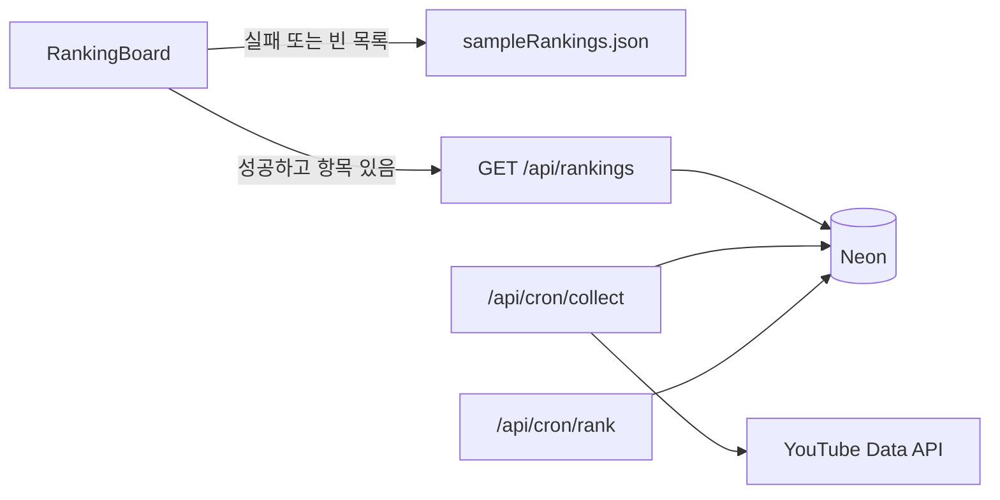

# K-TechRank Phase 1 MVP

워크스페이스에는 [명세](xref/D03%20SPEC%20YTB%20vertical-ranking-board-spec.md)와 [스티치 디자인](xui/stitch_vertical_leaderboard_app_design)만 있습니다. 앱 코드는 루트에 새로 만듭니다.

범위는 주간 성장률(`growth_rate`) 한 가지입니다. 일간 조회수·화제성·채널 상세·뉴스레터·스폰서·스플래시·홈·프로필은 만들지 않습니다. 화면은 [랭킹 보드 HTML](xui/stitch_vertical_leaderboard_app_design/vertical_ranking_board_k_techrank/code.html)과 [DESIGN.md](xui/stitch_vertical_leaderboard_app_design/k_tech_intelligence_ledger/DESIGN.md)의 토큰(네이비 `#1E3A5F`, 로열 블루 `#1A56A4`, 스카이 `#0EA5E9`, 하락 코랄 `#F43F5E`, 1~3위 메달 색)만 적용합니다.

## 동작 방식

`npm run dev`만으로 랭킹 카드가 보입니다. `/api/rankings`가 없거나 비어 있으면 샘플 JSON으로 넘어가고, 상단에 **샘플 데이터** 배지를 붙입니다. `DATABASE_URL`이 있으면 같은 화면이 Neon 결과를 그대로 씁니다.

## 만들 파일

- 프론트: Vite 6 + React 19 + Tailwind. `src/App.jsx`는 랭킹 보드만 렌더합니다.
- [schema.sql](schema.sql): 명세 5절 테이블 전체. MVP 계산은 `channels`, `channel_snapshots`, `rankings`만 사용하고, `videos` / `video_snapshots`는 수집 코드가 채워 둡니다.
- [seed/channels.json](seed/channels.json): 핸들 + `subCategory` 약 15개. 통계 숫자는 넣지 않습니다. 실제 채널 ID 변환은 `POST /api/admin/seed`가 `channels.list(forHandle)`로 합니다.
- [seed/sample.sql](seed/sample.sql): 가상 채널 ID(`UC_SAMPLE_01`…)와 오늘·7일 전 스냅샷, 미리 계산한 주간 랭킹. 채널명은 “샘플”로 표시해 실제 크리에이터 통계처럼 보이지 않게 합니다. 구독자 1만 미만 1개, 스냅샷 부족한 NEW 1개는 랭킹에서 빠지는지 확인용으로 넣습니다.
- API (`type: module`, Vercel Node 핸들러)
  - [api/lib/db.js](api/lib/db.js): `@neondatabase/serverless`
  - [api/lib/youtube.js](api/lib/youtube.js): `channels.list`, `playlistItems.list`, `videos.list`만. `search.list` 없음. ID 50개 배치.
  - [api/lib/metrics.js](api/lib/metrics.js): 순수 함수. 주간 성장률 = max(0, 오늘 조회수 − 7일 전) / 7일 전 × 100. 구독자 1만 미만·기준 스냅샷 없음은 제외.
  - [api/cron/collect.js](api/cron/collect.js): `Bearer CRON_SECRET`. 채널 통계 upsert, 업로드 재생목록은 10개씩 병렬, 영상 통계 upsert.
  - [api/cron/rank.js](api/cron/rank.js): 주간 `growth_rate` TOP 50과 `prev_rank` 저장.
  - [api/rankings.js](api/rankings.js): `period=weekly&metric=growth_rate&sub=all|llm|vibe|ml|cloud|career`
  - [api/admin/seed.js](api/admin/seed.js): `Bearer ADMIN_SECRET` + `seed/channels.json`
- [vercel.json](vercel.json): Cron `0 21 * * *` 수집, `30 21 * * *` 랭킹. SPA fallback은 `/api`를 제외합니다.
- [.env.example](.env.example): `YOUTUBE_API_KEY`, `DATABASE_URL`, `CRON_SECRET`, `ADMIN_SECRET`. `VITE_` 접두사 없음.
- [public/logo.svg](public/logo.svg): 스티치 엠블럼 SVG를 그대로 둡니다.
- `public/robots.txt`, `sitemap.xml`, `index.html`의 title·description·OG.

## 랭킹 보드 UI

한 컬럼, 모바일 우선, 데스크톱은 `max-width` 약 720px로 가운데 정렬합니다.

- 헤더: 로고 + K-TechRank, 기준일
- 카테고리 칩: 전체 / LLM 활용 / 바이브코딩 / 데이터·ML / 클라우드 / IT 커리어. 쿼리 `sub`로 거르고, 샘플 모드에서도 같은 필터가 동작합니다.
- 카드: 순위, ▲▼ 변동(상승 `#0EA5E9`, 하락 `#F43F5E`), 썸네일, 채널명, 분야, 성장률(JetBrains Mono, tabular-nums), 구독자. 1~3위는 금·은·동 왼쪽 바와 메달.
- 카드 클릭은 이번 범위에서 채널 상세로 가지 않습니다. YouTube 핸들 링크만 외부로 엽니다.
- 푸터 한 줄: YouTube Data API 출처. 방법론 문장은 카드 위 안내 바에 주간 성장률 산식만 적습니다.

폰트는 Plus Jakarta Sans, Inter, JetBrains Mono와 한국어용 Pretendard 폴백입니다.

## 확인 방법

- `npm run dev` 후 `/`에서 샘플 TOP 목록, 카테고리 필터, 1~3위 메달, 상승·하락 색이 보이는지 확인합니다.
- `node --test`로 `metrics.js`의 성장률·제외 규칙을 검증합니다.
- Neon에 `schema.sql`과 `seed/sample.sql`을 넣은 뒤 `vercel dev`로 `/api/rankings?period=weekly&metric=growth_rate`가 샘플과 같은 형태를 반환하는지는 환경변수가 있을 때 확인합니다. 키와 DB URL은 커밋하지 않습니다.
