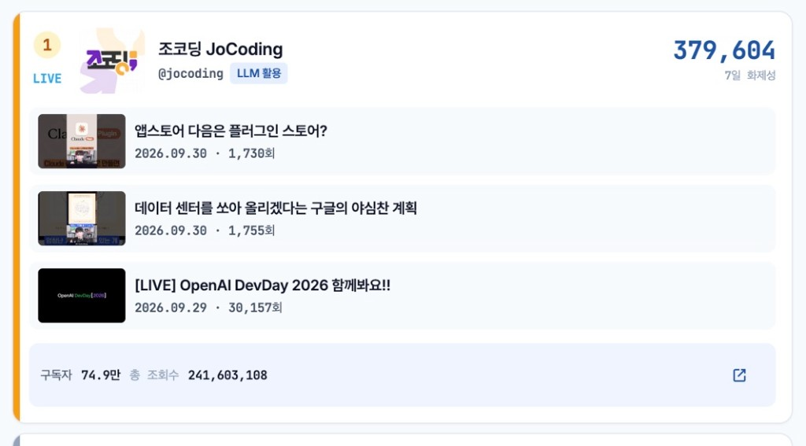

# K-TechRank



한국어 AI·테크 교육 유튜브 채널의 세로형 랭킹 보드입니다. Phase 1에서는 채널 수집·랭킹 API와 랭킹 보드 한 화면을 구현했습니다.

## 이번 작업에서 만든 것

- **실시간 보드.** YouTube Data API로 시드 채널을 읽고, 구독자 1,000명 이상이며 최근 90일 업로드가 3개 이상인 채널만 보여 줍니다. 점수는 최근 7일 영상의 `조회수 + 좋아요×10`입니다. `search.list`는 쓰지 않고, 핸들과 채널 ID로만 조회합니다.
- **주간 성장률 경로.** Neon PostgreSQL에 오늘과 7일 전 스냅샷이 있으면 `(오늘 조회수 − 7일 전 조회수) / 7일 전 조회수`로 순위를 계산합니다. 구독자 1만 명 미만이거나 기준 스냅샷이 없는 채널은 빠집니다.
- **화면 데이터 순서.** YouTube 실시간 보드가 오면 그 결과를 쓰고, 없으면 저장된 주간 성장률을 씁니다. 둘 다 없으면 샘플 랭킹을 보여 주며 상단에 출처 배지를 붙입니다.
- **환경 상태 카드.** YouTube 키는 API로 확인하고, 데이터베이스는 `SELECT 1`로 연결을 확인합니다. Cron·관리자 비밀값은 입력 여부만 표시합니다. 비밀값 자체는 화면에 나오지 않습니다.
- **분야 필터.** 전체, LLM 활용, 바이브코딩, 데이터/ML, 클라우드, IT 커리어. 필터를 바꿔도 전체 기준 순위 숫자는 유지됩니다.
- **디자인.** 랭킹 보드 최대 너비 720px, 1~3위 메달, 채널 이미지와 영상 썸네일, 영상 날짜·조회수, YouTube 원본 링크.
- **서버 API.** 스키마(`schema.sql`), 시드 채널(`seed/channels.json`), 수집·랭킹 Cron, 랭킹 조회, 관리자 시드 등록. 로컬 `npm run dev`는 `/api/health`와 `/api/board`를 직접 처리합니다.

## 실행

```bash
npm install
cp .env.example .env
npm run dev
```

브라우저에서 `http://127.0.0.1:5173/` 을 엽니다. YouTube 실시간 보드만 보려면 `YOUTUBE_API_KEY`만 있으면 됩니다. 주간 성장률을 저장하려면 `DATABASE_URL`과 Neon에 실행한 `schema.sql`이 추가로 필요합니다.

```bash
npm test
```

성장률 계산, 환경 상태 분류, 채널 선정 조건 테스트를 실행합니다.

## 오류 수정

- **개발 서버가 API 파일을 브라우저 스크립트로 내려주던 문제.** `/api` 아래 파일을 Vite가 JavaScript로 제공하면서 Neon 드라이버가 클라이언트 의존성에 섞였습니다. `/api/health`와 `/api/board`만 처리하고, 나머지 `/api`는 JSON 404를 반환합니다. Neon 패키지는 브라우저 최적화 대상에서 제외했습니다.
- **랭킹 날짜가 잘리던 문제.** 데이터베이스가 돌려준 날짜 객체를 문자열로 자른 뒤 `YYYY-MM-DD`가 깨질 수 있었습니다. 날짜 객체와 문자열을 각각 `YYYY-MM-DD`로 맞춥니다.
- **API 키가 오류 문구에 남을 수 있던 문제.** YouTube 오류 본문의 `key=` 값은 응답 전에 지웁니다. 환경 상태 문구에도 키 문자열이 들어가지 않습니다.
- **좋아요 수가 비공개일 때 0으로 저장되던 문제.** 응답에 `likeCount`가 없으면 `null`로 두고, 화제성 점수에서만 0으로 계산합니다.
- **데이터베이스 안내 문구가 실시간 보드와 어긋나던 문제.** 연결 문자열이 비어 있을 때 샘플 데이터를 본다고 적혀 있었습니다. 지금은 주간 성장률 대신 YouTube에서 바로 가져온 채널을 표시한다고 안내합니다.
- **환경 변수를 매 요청마다 읽던 문제.** 로컬 서버는 `/api/health`와 `/api/board`를 처리할 때만 `.env`를 읽습니다.
- **썸네일이 작던 문제.** 채널 이미지는 48px에서 58px로, 영상 썸네일은 40×64px에서 48×77px로 키웠습니다.

## 배포

`vercel.json`에 Cron 일정과 SPA 재작성 규칙이 들어 있습니다. 이번 저장소 반영에는 Vercel 배포를 포함하지 않았습니다.
